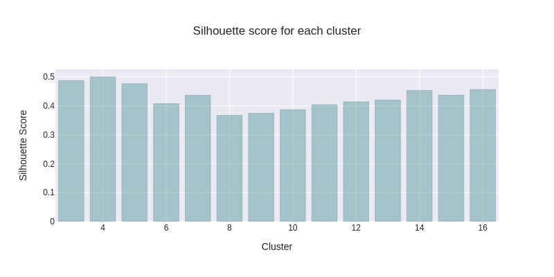
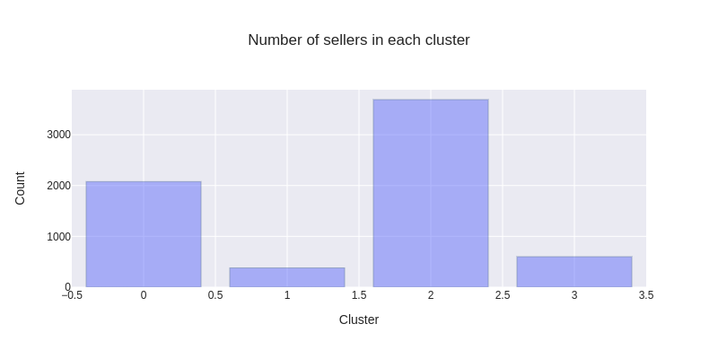
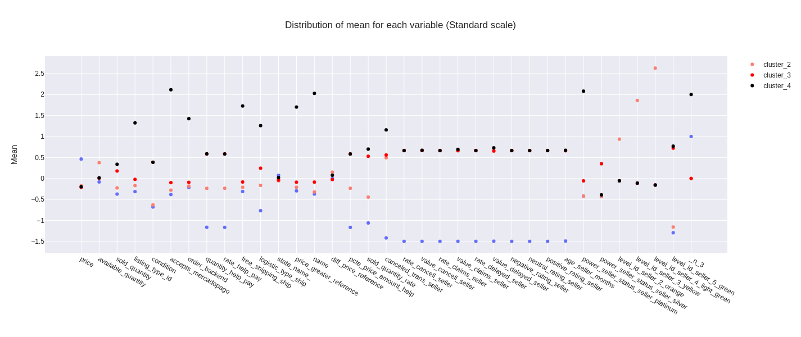

# K-means
# **Contenido del Git**

* Imágentes de los resultados del modelo de clusterización (K-means)
* Notebook: Construcción del marco de datos, EDA y Modelo

# **Business Case**:
El equipo comercial quiere realizar estrategias focalizadas para los sellers, pero en
este momento no existe una clasificación que permita identificar a aquellos que tienen
un buen perfil y son relevantes para el negocio. ¿Cómo podrías ayudar al equipo
comercial a identificar estos sellers?

# **Solución**

**La solución del problema se focalizó únicamente en Mecado Libre Colombia**

## **¿Qué información buscaste y utilizaste para el desarrollo de la solución?**

Para la solución realicé un muestreo teniendo en cuenta la categoría de los items que actualmente se venden en Colombia. Para cada categoría se extraen los 1000 primeros datos que se encuentren a partir del request. De esta manera, nuestro marco de datos inicial consta de una dimensión 33510 datos 22 variables.

Posteriormente, de una exploración inicial general se encuentra que no hay información completa que permita identificar a los **sellers**, por tal motivo esta información se obtiene mediante otro request.

Finalmente, la información que se tiene para realizar el modelo consta de las siguientes variables:

* price_mean, 
* available_quantity_mean, 
* sold_quantity_mean,  
* listing_type_id_unique,
* condition_unique, 
* accepts_mercadopago_total, 
* order_backen_sum,
* quantity_help_pay_mean,
* rate_help_pay_mean,
* free_shipping_ship_sum, 
* logistic_type_ship_unique,  
* state_name_unique,p
* price_greater_reference_sum",
* name_unique, 
* diff_price_referenc_mean,
* pcte_price_amount_help_mean,
* sold_quantity_rate_mean,
* canceled_trans_selle_mean,	
* rate_cancell_seller_mean,	
* value_cancell_seller_mean,
* rate_claims_seller_mean,
* value_claims_seller_mean,	
* rate_delayed_seller_mean,
* value_delayed_seller_mean,	
* negative_rating_seller_mean,
* neutral_rating_seller_mean,
* positive_rating_seller_mean,	
* age_seller_months_mean,
* power_seller_status_seller_platinum,	
* power_seller_status_seller_silver,
* level_id_seller_2_orange,
* level_id_seller_3_yellow,
* level_id_seller_4_light_green,
* level_id_seller_5_green,

La información anterior se escogio ya que se quiere incluir tanto comportamiento general del sellers (ratings, reclamos, entre otros), como comportamiento medio del seller respecto a sus ventas (precio medio de sus productos, cantidad de categorías asociadas,)

## **Qué enfoque escogiste, y cómo la abordaste. ¿Qué metodologías aplicaste? ¿Qué métricas de evaluación utilizaste?**

Para la solución del problema se escogió un modelo no survisado, en este caso **K-means**. Con este modelo buscamos encontrar el número óptimo de segmentos de **sellers** que actualmente hay en MeLi. De esta manera el equipo comercial podrá desarrollar estrategias focalizadas para cada segmento.

El algorimo se evaluó para diferentes clusters = [ 2,4,5,6,7,8,9,10,11,12,13,14,15,16] y la cantidad de segmentos óptimos se escogió mediante la métrica de **Silhouette Coefficient**:  es una métrica utilizada para calcular la bondad de una técnica de clusterización. Su valor se encuentra entre -1 a 1.

* 1: Significa que los clusters están bien separados unos de otros y se distinguen claramente.

* 0: Los clusters de medios son indiferentes, o podemos decir que la distancia entre clusters no es significativa.

* -1: Los clusters de medios están asignados de forma errónea w

## **¿Cuál es tu solución final? ¿Cómo se comporta? ¿Cómo soluciona o ayuda a solucionar el problema de negocio?**

**Silhouette Coefficient**

El mejor score se encuentra para n_clusters = 4 (score=0.50). A continiación presentamos la distribución de la cantidad de sellers en cada segmento

Finalmente para lograr un mejor entendimiento del comportamiento de cada cluster se desarrolló está gráfica:

Cluster 1: En este cluster encontramos los **sellers** con los precios más altos, con la cantidad más baja de ventas, este tipo de cliente no tiene alta frecuenta en financiar sus productos. También poseen la cantidad más baja de envió gratis, son los **sellers** con menor antiguedad en MeLi y mayor cantidad de ciudades registradas.

Cluster 2: En este cluster encontramos los **sellers** que cuentan con la mayor cantidad de productos dispobles y con la mayor cantidad de clientes clasificados como green. Adicionalmente, son el segundo segmento con ventas más bajas y con menos envíos gratis

Cluster 3: En este cluster encontramos **sellers**   con la menor cantidad de ciudad registradas. Por otra parte, tiene con la mayor cantidad de **sellers silvers**

Cluster 4: En este cluster se encuentran los **sellers** con la mayor cantidad de ventas, cuyos items tienen alta cardinalidad en la variable listing_id,con la mayor cantidad de veces que se encuentra que se acepta mercado pago (como opción de pago), este segmento presenta la mayor cantidad de envíos gratis.

# **Próximos pasos**

La construcción del marco de datos también permitiría dar solución al siguiente problema:

● En la vertical de pricing están interesados en dar sugerencias de descuentos para los
ítems del Marketplace. Actualmente, tienen un equipo experto en fijación de precios,
los cuales revisan ítems manualmente para encontrar si el ítem requiere un descuento
y cuál sería el descuento adecuado para generar un aumento en las ventas en el
corto plazo. Este equipo busca disminuir las cargas manuales que tienen sus
colaboradores para que puedan dedicarse a otras actividades más rentables para el
negocio.

Para dar solución a este problema se plantea un modelo supervisado, en el cual la variable objetivo es continua y corresponde a la razón entre la cantidad de productos vendidos sobre el total (**sold_quantity_rate**). Este modelo permitirá evaluar que porcentaje de un itém en particular se venderá y junto con el equipo Pricing se fija un punto de corte para sugerir descuentos para aquellos items que no alcancen a superar dicho punto de corte.
